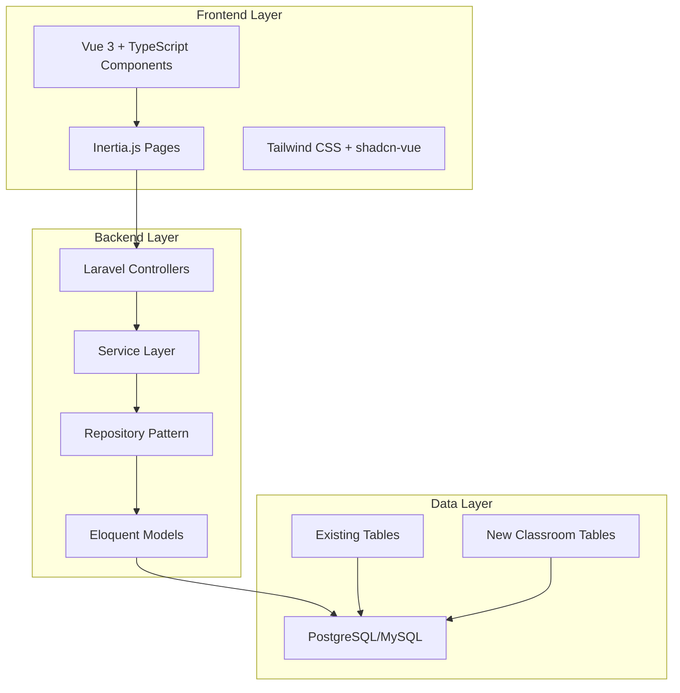

# Design Document

## Overview

The Classroom feature extends the existing Coderium platform to provide a comprehensive learning management system. The design leverages Laravel's existing architecture patterns, integrating seamlessly with the current User, Post, Playlist, and Media models while introducing new educational-specific models and relationships.

The system follows a hierarchical content structure (Track → Level → Module → Lesson) with comprehensive progress tracking, assessment capabilities, and role-based access control. The architecture emphasizes API-driven design, mobile-first responsive UI, and scalable backend patterns compatible with the existing Laravel + Vue 3 + Inertia.js stack.

## Architecture

### High-Level Architecture



### Integration with Existing System

The Classroom feature integrates with existing Coderium components:

- **User Model**: Extended with role-based permissions for learners and instructors
- **Media Model**: Leveraged for lesson content (videos, PDFs, images) via polymorphic relationships
- **Authentication**: Uses existing Laravel Fortify with 2FA support
- **Admin Panel**: Extended with classroom management interfaces
- **API Structure**: Follows existing RESTful patterns with Inertia.js integration

## Components and Interfaces

### Core Models and Relationships

```mermaid
erDiagram
    User ||--o{ TrackEnrollment : enrolls
    User ||--o{ LessonProgress : tracks
    User ||--o{ AssessmentAttempt : attempts
    User ||--o{ DiscussionPost : posts
    User ||--o{ AssignmentSubmission : submits
    
    Track ||--o{ Level : contains
    Track ||--o{ TrackEnrollment : has
    Track ||--o{ Discussion : has
    
    Level ||--o{ Module : contains
    
    Module ||--o{ Lesson : contains
    Module ||--o{ Assessment : has
    Module ||--o{ Assignment : has
    
    Lesson ||--o{ LessonProgress : tracks
    Lesson ||--o{ Assessment : has
    Lesson ||--o{ Discussion : has
    Lesson ||--|| Media : "polymorphic"
    
    Assessment ||--o{ Question : contains
    Assessment ||--o{ AssessmentAttempt : has
    
    Question ||--o{ QuestionOption : has
    
    AssessmentAttempt ||--o{ AttemptAnswer : contains
    
    Discussion ||--o{ DiscussionPost : contains
    
    Assignment ||--o{ AssignmentSubmission : has
    
    Media ||--|| Lesson : "polymorphic"
    Media ||--|| Track : "polymorphic"
    Media ||--|| Module : "polymorphic"
```



### Model Specifications

#### Track Model
```php
class Track extends Model
{
    protected $fillable = [
        'title', 'description', 'slug', 'is_premium', 
        'price', 'is_published', 'difficulty_level',
        'estimated_duration', 'instructor_id'
    ];
    
    // Relationships
    public function levels() // hasMany
    public function enrollments() // hasMany
    public function instructor() // belongsTo User
    public function media() // morphMany
    public function discussions() // hasMany
}
```

#### Level Model
```php
class Level extends Model
{
    protected $fillable = [
        'track_id', 'title', 'description', 'difficulty',
        'order_index', 'is_published'
    ];
    
    // Relationships
    public function track() // belongsTo
    public function modules() // hasMany
}
```

#### Module Model
```php
class Module extends Model
{
    protected $fillable = [
        'level_id', 'title', 'description', 'order_index',
        'estimated_duration', 'is_published'
    ];
    
    // Relationships
    public function level() // belongsTo
    public function lessons() // hasMany
    public function assessments() // hasMany
    public function assignments() // hasMany
    public function media() // morphMany
}
```

#### Lesson Model
```php
class Lesson extends Model
{
    protected $fillable = [
        'module_id', 'title', 'content', 'order_index',
        'estimated_duration', 'is_published', 'lesson_type'
    ];
    
    // Relationships
    public function module() // belongsTo
    public function progress() // hasMany LessonProgress
    public function assessments() // hasMany
    public function discussions() // hasMany
    public function media() // morphMany
}
```

### Service Layer Architecture

#### TrackService
- `createTrack(array $data): Track`
- `updateTrack(Track $track, array $data): Track`
- `publishTrack(Track $track): bool`
- `getPublishedTracks(): Collection`
- `getTrackWithProgress(Track $track, User $user): array`

#### EnrollmentService
- `enrollUser(User $user, Track $track): TrackEnrollment`
- `checkEnrollmentAccess(User $user, Track $track): bool`
- `getEnrolledTracks(User $user): Collection`
- `calculateTrackProgress(User $user, Track $track): float`

#### ProgressService
- `markLessonComplete(User $user, Lesson $lesson): LessonProgress`
- `calculateModuleProgress(User $user, Module $module): float`
- `calculateLevelProgress(User $user, Level $level): float`
- `generateProgressReport(User $user, Track $track): array`

#### AssessmentService
- `createAssessment(array $data): Assessment`
- `submitAssessment(User $user, Assessment $assessment, array $answers): AssessmentAttempt`
- `gradeAssessment(AssessmentAttempt $attempt): float`
- `checkPassingScore(AssessmentAttempt $attempt): bool`

### API Endpoints Structure

#### Track Management
- `GET /api/tracks` - List published tracks
- `POST /api/tracks` - Create track (instructor only)
- `GET /api/tracks/{track}` - Get track details
- `PUT /api/tracks/{track}` - Update track (instructor only)
- `POST /api/tracks/{track}/enroll` - Enroll in track

#### Content Access
- `GET /api/tracks/{track}/levels` - Get track levels
- `GET /api/levels/{level}/modules` - Get level modules
- `GET /api/modules/{module}/lessons` - Get module lessons
- `GET /api/lessons/{lesson}` - Get lesson content

#### Progress Tracking
- `POST /api/lessons/{lesson}/complete` - Mark lesson complete
- `GET /api/tracks/{track}/progress` - Get user progress
- `GET /api/users/{user}/progress` - Get overall progress

#### Assessment System
- `GET /api/assessments/{assessment}` - Get assessment questions
- `POST /api/assessments/{assessment}/submit` - Submit assessment
- `GET /api/assessments/{assessment}/results` - Get assessment results

## Data Models

### Database Schema Design

#### Core Tables

```sql
-- Tracks table
CREATE TABLE tracks (
    id BIGINT UNSIGNED PRIMARY KEY AUTO_INCREMENT,
    title VARCHAR(255) NOT NULL,
    description TEXT,
    slug VARCHAR(255) UNIQUE NOT NULL,
    is_premium BOOLEAN DEFAULT FALSE,
    price DECIMAL(8,2) NULL,
    is_published BOOLEAN DEFAULT FALSE,
    difficulty_level ENUM('beginner', 'intermediate', 'advanced') DEFAULT 'beginner',
    estimated_duration INTEGER, -- in minutes
    instructor_id BIGINT UNSIGNED,
    created_at TIMESTAMP NULL,
    updated_at TIMESTAMP NULL,
    FOREIGN KEY (instructor_id) REFERENCES users(id) ON DELETE SET NULL
);

-- Levels table
CREATE TABLE levels (
    id BIGINT UNSIGNED PRIMARY KEY AUTO_INCREMENT,
    track_id BIGINT UNSIGNED NOT NULL,
    title VARCHAR(255) NOT NULL,
    description TEXT,
    difficulty ENUM('beginner', 'intermediate', 'advanced') NOT NULL,
    order_index INTEGER NOT NULL DEFAULT 0,
    is_published BOOLEAN DEFAULT FALSE,
    created_at TIMESTAMP NULL,
    updated_at TIMESTAMP NULL,
    FOREIGN KEY (track_id) REFERENCES tracks(id) ON DELETE CASCADE
);

-- Modules table
CREATE TABLE modules (
    id BIGINT UNSIGNED PRIMARY KEY AUTO_INCREMENT,
    level_id BIGINT UNSIGNED NOT NULL,
    title VARCHAR(255) NOT NULL,
    description TEXT,
    order_index INTEGER NOT NULL DEFAULT 0,
    estimated_duration INTEGER, -- in minutes
    is_published BOOLEAN DEFAULT FALSE,
    created_at TIMESTAMP NULL,
    updated_at TIMESTAMP NULL,
    FOREIGN KEY (level_id) REFERENCES levels(id) ON DELETE CASCADE
);

-- Lessons table
CREATE TABLE lessons (
    id BIGINT UNSIGNED PRIMARY KEY AUTO_INCREMENT,
    module_id BIGINT UNSIGNED NOT NULL,
    title VARCHAR(255) NOT NULL,
    content LONGTEXT,
    order_index INTEGER NOT NULL DEFAULT 0,
    estimated_duration INTEGER, -- in minutes
    is_published BOOLEAN DEFAULT FALSE,
    lesson_type ENUM('text', 'video', 'interactive') DEFAULT 'text',
    created_at TIMESTAMP NULL,
    updated_at TIMESTAMP NULL,
    FOREIGN KEY (module_id) REFERENCES modules(id) ON DELETE CASCADE
);
```

#### Progress Tracking Tables

```sql
-- Track enrollments
CREATE TABLE track_enrollments (
    id BIGINT UNSIGNED PRIMARY KEY AUTO_INCREMENT,
    user_id BIGINT UNSIGNED NOT NULL,
    track_id BIGINT UNSIGNED NOT NULL,
    enrolled_at TIMESTAMP DEFAULT CURRENT_TIMESTAMP,
    completed_at TIMESTAMP NULL,
    progress_percentage DECIMAL(5,2) DEFAULT 0.00,
    created_at TIMESTAMP NULL,
    updated_at TIMESTAMP NULL,
    UNIQUE KEY unique_enrollment (user_id, track_id),
    FOREIGN KEY (user_id) REFERENCES users(id) ON DELETE CASCADE,
    FOREIGN KEY (track_id) REFERENCES tracks(id) ON DELETE CASCADE
);

-- Lesson progress
CREATE TABLE lesson_progress (
    id BIGINT UNSIGNED PRIMARY KEY AUTO_INCREMENT,
    user_id BIGINT UNSIGNED NOT NULL,
    lesson_id BIGINT UNSIGNED NOT NULL,
    completed_at TIMESTAMP NULL,
    time_spent INTEGER DEFAULT 0, -- in seconds
    created_at TIMESTAMP NULL,
    updated_at TIMESTAMP NULL,
    UNIQUE KEY unique_progress (user_id, lesson_id),
    FOREIGN KEY (user_id) REFERENCES users(id) ON DELETE CASCADE,
    FOREIGN KEY (lesson_id) REFERENCES lessons(id) ON DELETE CASCADE
);
```

#### Assessment Tables

```sql
-- Assessments
CREATE TABLE assessments (
    id BIGINT UNSIGNED PRIMARY KEY AUTO_INCREMENT,
    assessable_type VARCHAR(255) NOT NULL, -- lesson or module
    assessable_id BIGINT UNSIGNED NOT NULL,
    title VARCHAR(255) NOT NULL,
    description TEXT,
    passing_score DECIMAL(5,2) DEFAULT 70.00,
    max_attempts INTEGER DEFAULT 3,
    time_limit INTEGER NULL, -- in minutes
    is_required BOOLEAN DEFAULT FALSE,
    created_at TIMESTAMP NULL,
    updated_at TIMESTAMP NULL,
    INDEX assessable_index (assessable_type, assessable_id)
);

-- Questions
CREATE TABLE questions (
    id BIGINT UNSIGNED PRIMARY KEY AUTO_INCREMENT,
    assessment_id BIGINT UNSIGNED NOT NULL,
    question_text TEXT NOT NULL,
    question_type ENUM('multiple_choice', 'true_false', 'code_output', 'conceptual') NOT NULL,
    points INTEGER DEFAULT 1,
    order_index INTEGER NOT NULL DEFAULT 0,
    explanation TEXT,
    created_at TIMESTAMP NULL,
    updated_at TIMESTAMP NULL,
    FOREIGN KEY (assessment_id) REFERENCES assessments(id) ON DELETE CASCADE
);

-- Question options
CREATE TABLE question_options (
    id BIGINT UNSIGNED PRIMARY KEY AUTO_INCREMENT,
    question_id BIGINT UNSIGNED NOT NULL,
    option_text TEXT NOT NULL,
    is_correct BOOLEAN DEFAULT FALSE,
    order_index INTEGER NOT NULL DEFAULT 0,
    created_at TIMESTAMP NULL,
    updated_at TIMESTAMP NULL,
    FOREIGN KEY (question_id) REFERENCES questions(id) ON DELETE CASCADE
);

-- Assessment attempts
CREATE TABLE assessment_attempts (
    id BIGINT UNSIGNED PRIMARY KEY AUTO_INCREMENT,
    user_id BIGINT UNSIGNED NOT NULL,
    assessment_id BIGINT UNSIGNED NOT NULL,
    score DECIMAL(5,2) DEFAULT 0.00,
    max_score INTEGER NOT NULL,
    passed BOOLEAN DEFAULT FALSE,
    started_at TIMESTAMP DEFAULT CURRENT_TIMESTAMP,
    completed_at TIMESTAMP NULL,
    time_taken INTEGER, -- in seconds
    attempt_number INTEGER DEFAULT 1,
    created_at TIMESTAMP NULL,
    updated_at TIMESTAMP NULL,
    FOREIGN KEY (user_id) REFERENCES users(id) ON DELETE CASCADE,
    FOREIGN KEY (assessment_id) REFERENCES assessments(id) ON DELETE CASCADE
);
```

### Polymorphic Media Integration

The existing Media model will be extended to support classroom content through polymorphic relationships:

```php
// Existing Media model extended
class Media extends Model
{
    // Existing relationships...
    
    // New polymorphic relationships for classroom
    public function mediable()
    {
        return $this->morphTo();
    }
}

// Usage in classroom models
class Lesson extends Model
{
    public function media()
    {
        return $this->morphMany(Media::class, 'mediable');
    }
}
```

## Correctness Properties

*A property is a characteristic or behavior that should hold true across all valid executions of a system—essentially, a formal statement about what the system should do. Properties serve as the bridge between human-readable specifications and machine-verifiable correctness guarantees.*

Based on the prework analysis and property reflection, here are the consolidated correctness properties:

### Property 1: Content Hierarchy Integrity
*For any* content hierarchy operation (create, update, delete), the system should maintain proper parent-child relationships and referential integrity across tracks, levels, modules, and lessons
**Validates: Requirements 1.1, 1.2, 1.3, 1.4, 1.5**

### Property 2: Content Deletion with Progress Preservation  
*For any* content deletion operation, the system should cascade deletions appropriately while preserving all related learner progress data
**Validates: Requirements 1.6**

### Property 3: Media Validation and Storage
*For any* media upload (video, PDF, image), the system should validate file types, sizes, and constraints (e.g., video duration limits) and store valid files while rejecting invalid ones
**Validates: Requirements 2.3, 2.4, 2.5, 2.6**

### Property 4: Rich Content Management
*For any* lesson content creation, the system should properly store and retrieve text with rich formatting and code snippets with appropriate syntax highlighting
**Validates: Requirements 2.1, 2.2**

### Property 5: Role-Based Permission Management
*For any* user role assignment or change, the system should immediately grant or revoke appropriate permissions based on the role (learner, instructor) and maintain compatibility with existing authentication
**Validates: Requirements 3.1, 3.2, 3.3, 3.4, 3.5**

### Property 6: Enrollment Access Control
*For any* track access attempt, the system should verify enrollment status, payment verification for premium tracks, and capacity limits before granting access
**Validates: Requirements 4.1, 4.2, 4.3, 4.4, 4.5**

### Property 7: Assessment Functionality
*For any* assessment creation or configuration, the system should support all question types (multiple choice, true/false, code output, conceptual), allow configurable passing scores, and support placement at lesson or module levels
**Validates: Requirements 5.1, 5.2, 5.3**

### Property 8: Assessment Progression Control
*For any* required assessment, the system should prevent learner progression until passing scores are achieved
**Validates: Requirements 5.4**

### Property 9: Assessment Result Management
*For any* assessment completion, the system should store results with timestamps and scores, and provide immediate feedback to learners
**Validates: Requirements 5.5, 5.6**

### Property 10: Progress Tracking Accuracy
*For any* lesson completion or progress calculation, the system should accurately record completion timestamps and compute correct percentages for all hierarchy levels (lesson, module, level, track)
**Validates: Requirements 6.1, 6.2, 6.6**

### Property 11: Progress Visualization
*For any* progress display, the system should show visual progress bars, percentage indicators, and award achievement badges at appropriate milestones
**Validates: Requirements 6.3, 6.4**

### Property 12: Certificate Generation
*For any* track completion, the system should generate digital completion certificates
**Validates: Requirements 6.5**

### Property 13: Discussion System Functionality
*For any* lesson with discussions, the system should provide accessible discussion threads, organize posts in Q&A format, highlight instructor responses, and send notifications to relevant participants
**Validates: Requirements 7.1, 7.2, 7.3, 7.5**

### Property 14: Content Moderation Tools
*For any* discussion requiring moderation, the system should provide basic content moderation tools
**Validates: Requirements 7.4**

### Property 15: Assignment Management
*For any* assignment creation or submission, the system should support module-level attachment, accept both repository links and file uploads, and provide evaluation checklists for instructors
**Validates: Requirements 8.1, 8.2, 8.3**

### Property 16: Assignment Grading and Feedback
*For any* assignment grading, the system should store grades and feedback, and notify learners of results
**Validates: Requirements 8.4, 8.5**

### Property 17: Mobile Responsive Design
*For any* device access, the system should provide responsive layouts, clear navigation hierarchy, comprehensive progress display, and touch-friendly interactions
**Validates: Requirements 9.1, 9.2, 9.3, 9.5**

### Property 18: System Integration Compatibility
*For any* system operation, the system should use API-driven architecture compatible with existing Laravel patterns, integrate with existing database infrastructure, leverage existing media management, and maintain compatibility with existing models
**Validates: Requirements 10.1, 10.2, 10.3, 10.4**

## Error Handling

### Validation Errors
- **Content Creation**: Validate required fields, content length limits, and hierarchy constraints
- **File Uploads**: Validate file types, sizes, and duration limits with descriptive error messages
- **Assessment Configuration**: Validate passing scores (0-100%), question types, and option requirements
- **Enrollment**: Validate payment status, capacity limits, and prerequisite completion

### Access Control Errors
- **Unauthorized Access**: Return 403 Forbidden with clear messaging for insufficient permissions
- **Unenrolled Access**: Return 401 Unauthorized with enrollment prompts for track content
- **Premium Content**: Return 402 Payment Required with upgrade options for premium tracks
- **Unpublished Content**: Return 404 Not Found for unpublished content accessed by non-instructors

### Data Integrity Errors
- **Cascade Deletion**: Prevent deletion of content with dependent progress data, offer soft deletion
- **Referential Integrity**: Handle foreign key constraint violations gracefully with rollback
- **Concurrent Updates**: Use optimistic locking to prevent data corruption from simultaneous edits
- **Progress Calculation**: Handle edge cases like empty modules or deleted lessons in progress calculations

### System Integration Errors
- **Media Processing**: Handle file processing failures with retry mechanisms and fallback options
- **Authentication**: Gracefully handle Fortify authentication failures and session timeouts
- **Database Connectivity**: Implement connection pooling and retry logic for database operations
- **API Rate Limiting**: Implement rate limiting with clear error messages and retry-after headers

### User Experience Error Handling
- **Form Validation**: Provide real-time validation feedback with specific field-level errors
- **Assessment Submission**: Handle network failures during assessment submission with auto-save
- **Progress Sync**: Handle offline scenarios with local storage and sync when connection restored
- **File Upload**: Provide progress indicators and handle upload failures with retry options

## Testing Strategy

### Dual Testing Approach

The Classroom feature will employ both unit testing and property-based testing to ensure comprehensive coverage:

**Unit Tests**: Focus on specific examples, edge cases, and integration points
- Specific user scenarios and workflows
- Edge cases like empty content, boundary values, and error conditions  
- Integration between classroom components and existing Coderium systems
- API endpoint responses and error handling

**Property Tests**: Verify universal properties across all inputs using randomized data
- Content hierarchy integrity across all possible data combinations
- Permission systems work correctly for all user role combinations
- Progress calculations are accurate for all possible completion states
- Assessment scoring is consistent across all question type combinations

### Property-Based Testing Configuration

**Testing Framework**: PHPUnit with Eris (PHP property-based testing library)
- Minimum 100 iterations per property test to ensure comprehensive input coverage
- Each property test references its corresponding design document property
- Tag format: **Feature: classroom, Property {number}: {property_text}**

**Test Data Generation**:
- **Content Generators**: Random tracks, levels, modules, lessons with valid hierarchies
- **User Generators**: Random users with different roles and enrollment states  
- **Assessment Generators**: Random assessments with various question types and configurations
- **Progress Generators**: Random completion states across content hierarchies

### Testing Coverage Areas

**Core Functionality Testing**:
- Content creation, modification, and deletion workflows
- User enrollment and access control mechanisms
- Assessment creation, submission, and grading processes
- Progress tracking and calculation accuracy
- Discussion and assignment management features

**Integration Testing**:
- Laravel Fortify authentication integration
- Existing Media model polymorphic relationships
- Database transaction handling and rollback scenarios
- API endpoint integration with Inertia.js frontend
- Mobile responsive behavior across device types

**Performance Testing**:
- Large content hierarchy navigation performance
- Concurrent user assessment submission handling
- Progress calculation efficiency with large datasets
- Media file upload and processing performance
- Database query optimization for complex relationships

### Test Environment Setup

**Database Testing**: Use SQLite in-memory database for fast test execution
**Media Testing**: Mock file uploads and use temporary storage for media tests
**Authentication Testing**: Use Laravel's built-in authentication testing helpers
**API Testing**: Use Laravel's HTTP testing features with Inertia.js test helpers
**Frontend Testing**: Use Vue Test Utils with TypeScript support for component testing

The testing strategy ensures that both specific use cases and general system properties are thoroughly validated, providing confidence in the system's correctness and reliability.
